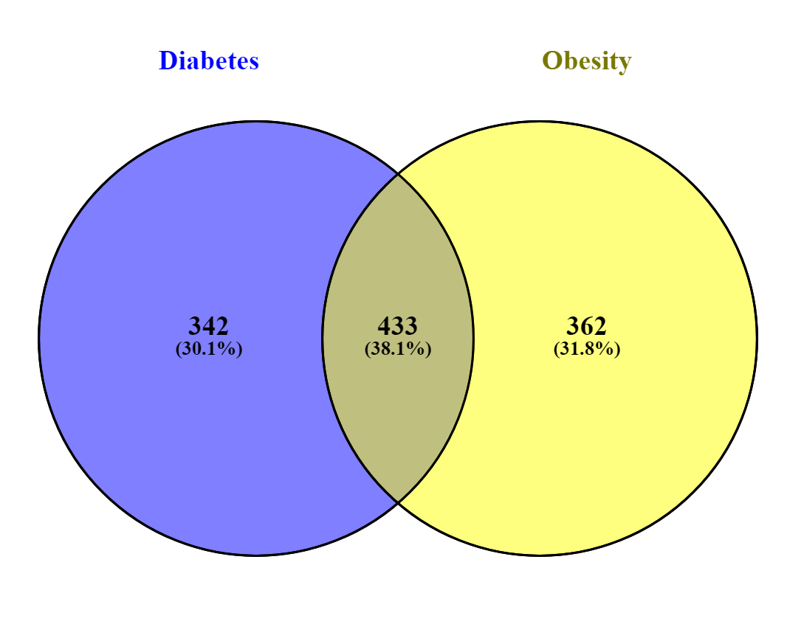

### Objective:

Prioritizing common regulators of obesity and diabetes

### Data
A transcriptomic analysis of primary mature adipocytes from lean, obese, and type 2 diabetic subjects. <br>
Adipocyte mRNA profiles from lean, obese and type 2 diabetic subjects, 6 samples each

#### RNASeq Analysis
- Quality check performed with FastQC software
- Sequenced reads were trimmed for adaptor sequence remnants using Trimmomatic
- Sequenced reads were aligned to reference genome hg38 using STAR, and mapped reads were counted by FeatureCounts.
- Differential gene expression was conducted with the R package DESeq2 (Wald test, Benjamini-Hochberg correction).
- Genome_build: hg38


#### Differentially Expressed Genes
**Obese-Vs-Lean** <br>
DEGs:  796 (Protein Coding) p value = 0.05, logFC 1<br>
455 Upregulated DEGs<br>
341 Downregulated DEGs<br><br>
**Diabetes-Vs-Lean**<br>
DEGs:  775 (Protein Coding) p value = 0.05, logFC 1<br>
392 Upregulated DEGs<br>
383 Downregulated DEGs<br>


#### Comparison



#### Next Plans
1. Construct Network among the common DEGs of obesity and diabetes
2. Create clusters using Kmeans or MCODE
3. Perform functional Enrichment with clusters obtained from kmeans
4. Overlap with KEGG for T2D and obesity pathways
5. Perform tissue specific analysis. [Adipocyte and Pancreas]
6. Perform Druggability analysis
7. Mapping with known obesity & T2D genes to check availability of novel players.

```python


```


