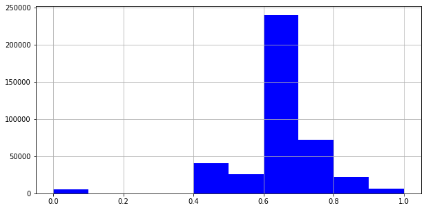

```python
import pandas as pd
import numpy as np
import matplotlib.pyplot as plt
import matplotlib.mlab as mlab
from bioinfokit import analys, visuz
```
   


```python

```


```python
#Load data from hippie
ppi = pd.read_table(r"F:\snijesh\Data\obese\GSE133099_RNASeq\results\hippie_current.txt", sep="\t")

ppi.head(5)
```


<div>

<table border="1" class="dataframe">
  <thead>
    <tr style="text-align: right;">
      <th></th>
      <th>Gene1</th>
      <th>EntrezID1</th>
      <th>Gene2</th>
      <th>EntrezID2</th>
      <th>Score</th>
      <th>Reference</th>
    </tr>
  </thead>
  <tbody>
    <tr>
      <td>0</td>
      <td>AL1A1_HUMAN</td>
      <td>216</td>
      <td>AL1A1_HUMAN</td>
      <td>216</td>
      <td>0.76</td>
      <td>experiments:in vivo,Two-hybrid;pmids:12081471,...</td>
    </tr>
    <tr>
      <td>1</td>
      <td>ITA7_HUMAN</td>
      <td>3679</td>
      <td>ACHA_HUMAN</td>
      <td>1134</td>
      <td>0.73</td>
      <td>experiments:in vivo,Affinity Capture-Western,a...</td>
    </tr>
    <tr>
      <td>2</td>
      <td>NEB1_HUMAN</td>
      <td>55607</td>
      <td>ACTG_HUMAN</td>
      <td>71</td>
      <td>0.65</td>
      <td>experiments:in vitro,in vivo;pmids:9362513,120...</td>
    </tr>
    <tr>
      <td>3</td>
      <td>SRGN_HUMAN</td>
      <td>5552</td>
      <td>CD44_HUMAN</td>
      <td>960</td>
      <td>0.63</td>
      <td>experiments:in vivo;pmids:9334256,16189514,167...</td>
    </tr>
    <tr>
      <td>4</td>
      <td>GRB7_HUMAN</td>
      <td>2886</td>
      <td>ERBB2_HUMAN</td>
      <td>2064</td>
      <td>0.90</td>
      <td>experiments:in vitro,in vivo,Reconstituted Com...</td>
    </tr>
  </tbody>
</table>
</div>


```python
#Distribution of PPI interaction by score
ppi['Score'].hist(bins=10, figsize=[10,5], facecolor='blue')
```


    <AxesSubplot:>





```python
#Consider the required columns with score >= 0.4
#Select EntrezID and Score
ppi_S4 = ppi[['EntrezID1', 'EntrezID2', 'Score']]
#Filter by score >= 0.4
ppi_S4 = ppi_S4[ppi_S4['Score'] >= 0.4]
#Remove the duplicated entries
ppi_S4 = ppi_S4.drop_duplicates()
ppi_S4
```


<div>

<table border="1" class="dataframe">
  <thead>
    <tr style="text-align: right;">
      <th></th>
      <th>EntrezID1</th>
      <th>EntrezID2</th>
      <th>Score</th>
    </tr>
  </thead>
  <tbody>
    <tr>
      <td>0</td>
      <td>216</td>
      <td>216</td>
      <td>0.76</td>
    </tr>
    <tr>
      <td>1</td>
      <td>3679</td>
      <td>1134</td>
      <td>0.73</td>
    </tr>
    <tr>
      <td>2</td>
      <td>55607</td>
      <td>71</td>
      <td>0.65</td>
    </tr>
    <tr>
      <td>3</td>
      <td>5552</td>
      <td>960</td>
      <td>0.63</td>
    </tr>
    <tr>
      <td>4</td>
      <td>2886</td>
      <td>2064</td>
      <td>0.90</td>
    </tr>
    <tr>
      <td>...</td>
      <td>...</td>
      <td>...</td>
      <td>...</td>
    </tr>
    <tr>
      <td>411425</td>
      <td>3329</td>
      <td>64975</td>
      <td>0.49</td>
    </tr>
    <tr>
      <td>411426</td>
      <td>56005</td>
      <td>9633</td>
      <td>0.63</td>
    </tr>
    <tr>
      <td>411427</td>
      <td>4288</td>
      <td>25902</td>
      <td>0.63</td>
    </tr>
    <tr>
      <td>411428</td>
      <td>22947</td>
      <td>7280</td>
      <td>0.56</td>
    </tr>
    <tr>
      <td>411429</td>
      <td>23405</td>
      <td>292</td>
      <td>0.63</td>
    </tr>
  </tbody>
</table>
<p>405159 rows × 3 columns</p>
</div>


```python

```


```python
#Load the common DEGs of Diabetes and Obesity
common_degs = pd.read_table(r"F:\snijesh\Data\obese\GSE133099_RNASeq\results\CommonDEGs.txt")
common_degs

#rename the column names 
common_degs.rename(columns = {'Entered':'GeneSymbol', 'Human Symbol':'GeneName', 'Gene ID':'EntrezID'}, inplace = True)
common_degs
```


<div>

<table border="1" class="dataframe">
  <thead>
    <tr style="text-align: right;">
      <th></th>
      <th>GeneSymbol</th>
      <th>GeneName</th>
      <th>EntrezID</th>
    </tr>
  </thead>
  <tbody>
    <tr>
      <td>0</td>
      <td>EGFL6</td>
      <td>EGFL6 (EGF like domain multiple 6)</td>
      <td>25975</td>
    </tr>
    <tr>
      <td>1</td>
      <td>LRRK1</td>
      <td>LRRK1 (leucine rich repeat kinase 1)</td>
      <td>79705</td>
    </tr>
    <tr>
      <td>2</td>
      <td>SEMA3G</td>
      <td>SEMA3G (semaphorin 3G)</td>
      <td>56920</td>
    </tr>
    <tr>
      <td>3</td>
      <td>ERBB2</td>
      <td>ERBB2 (erb-b2 receptor tyrosine kinase 2)</td>
      <td>2064</td>
    </tr>
    <tr>
      <td>4</td>
      <td>MFAP5</td>
      <td>MFAP5 (microfibril associated protein 5)</td>
      <td>8076</td>
    </tr>
    <tr>
      <td>...</td>
      <td>...</td>
      <td>...</td>
      <td>...</td>
    </tr>
    <tr>
      <td>426</td>
      <td>SERPINA3</td>
      <td>SERPINA3 (serpin family A member 3)</td>
      <td>12</td>
    </tr>
    <tr>
      <td>427</td>
      <td>RLN1</td>
      <td>RLN1 (relaxin 1)</td>
      <td>6013</td>
    </tr>
    <tr>
      <td>428</td>
      <td>EXOC3L1</td>
      <td>EXOC3L1 (exocyst complex component 3 like 1)</td>
      <td>283849</td>
    </tr>
    <tr>
      <td>429</td>
      <td>KCNJ11</td>
      <td>KCNJ11 (potassium inwardly rectifying channel ...</td>
      <td>3767</td>
    </tr>
    <tr>
      <td>430</td>
      <td>TOX3</td>
      <td>TOX3 (TOX high mobility group box family membe...</td>
      <td>27324</td>
    </tr>
  </tbody>
</table>
<p>431 rows × 3 columns</p>
</div>


```python
#Extracting all interactions of common DEGs
dfx = ppi[ppi['EntrezID1'].isin(common_degs['EntrezID']) & ppi['EntrezID2'].isin(common_degs['EntrezID'])]
#Drop duplicates if any
dfx=dfx.drop_duplicates()
dfx
```


<div>

<table border="1" class="dataframe">
  <thead>
    <tr style="text-align: right;">
      <th></th>
      <th>Gene1</th>
      <th>EntrezID1</th>
      <th>Gene2</th>
      <th>EntrezID2</th>
      <th>Score</th>
      <th>Reference</th>
    </tr>
  </thead>
  <tbody>
    <tr>
      <td>6</td>
      <td>DLG4_HUMAN</td>
      <td>1742</td>
      <td>ERBB2_HUMAN</td>
      <td>2064</td>
      <td>0.87</td>
      <td>experiments:in vivo,Two-hybrid,Affinity Captur...</td>
    </tr>
    <tr>
      <td>86</td>
      <td>SMUF2_HUMAN</td>
      <td>64750</td>
      <td>TM139_HUMAN</td>
      <td>135932</td>
      <td>0.63</td>
      <td>experiments:Two-hybrid;pmids:15231748;sources:...</td>
    </tr>
    <tr>
      <td>319</td>
      <td>AACT_HUMAN</td>
      <td>12</td>
      <td>AACT_HUMAN</td>
      <td>12</td>
      <td>0.52</td>
      <td>experiments:in vitro;pmids:14668352;sources:HP...</td>
    </tr>
    <tr>
      <td>426</td>
      <td>ERBB2_HUMAN</td>
      <td>2064</td>
      <td>AACT_HUMAN</td>
      <td>12</td>
      <td>0.52</td>
      <td>experiments:in vivo;pmids:10829039;sources:HPR...</td>
    </tr>
    <tr>
      <td>449</td>
      <td>FA5_HUMAN</td>
      <td>2153</td>
      <td>AACT_HUMAN</td>
      <td>12</td>
      <td>0.52</td>
      <td>experiments:in vitro;pmids:8216224;sources:HPR...</td>
    </tr>
    <tr>
      <td>...</td>
      <td>...</td>
      <td>...</td>
      <td>...</td>
      <td>...</td>
      <td>...</td>
      <td>...</td>
    </tr>
    <tr>
      <td>405932</td>
      <td>H15_HUMAN</td>
      <td>3009</td>
      <td>XPP2_HUMAN</td>
      <td>7512</td>
      <td>0.63</td>
      <td>experiments:cross-linking study;pmids:30021884...</td>
    </tr>
    <tr>
      <td>405952</td>
      <td>H15_HUMAN</td>
      <td>3009</td>
      <td>XIRP2_HUMAN</td>
      <td>129446</td>
      <td>0.63</td>
      <td>experiments:cross-linking study;pmids:30021884...</td>
    </tr>
    <tr>
      <td>406851</td>
      <td>NOTUM_HUMAN</td>
      <td>147111</td>
      <td>NOTUM_HUMAN</td>
      <td>147111</td>
      <td>0.72</td>
      <td>experiments:x-ray crystallography;pmids:257311...</td>
    </tr>
    <tr>
      <td>408999</td>
      <td>FPPS_HUMAN</td>
      <td>2224</td>
      <td>FPPS_HUMAN</td>
      <td>2224</td>
      <td>0.72</td>
      <td>experiments:x-ray crystallography;pmids:166848...</td>
    </tr>
    <tr>
      <td>410019</td>
      <td>H31_HUMAN</td>
      <td>8357</td>
      <td>MARE2_HUMAN</td>
      <td>10982</td>
      <td>0.49</td>
      <td>pmids:29568061;sources:IntAct</td>
    </tr>
  </tbody>
</table>
<p>220 rows × 6 columns</p>
</div>


```python
#Export the protein interaction network
dfx.to_csv("protein_interaction_common_DEGs.txt", sep='\t', index=False)
```


```python

```
