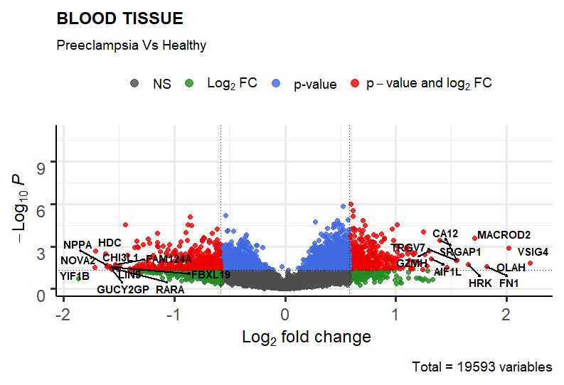
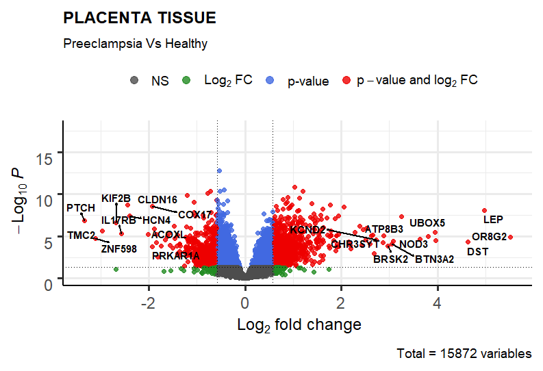

```python

```

## Identifying common biomarkers of "Preclampsia" from samples of "placenta" and "blood" tissue

### Source of samples
#### Placenta tissue
[GSE10588](https://www.ncbi.nlm.nih.gov/geo/query/acc.cgi?acc=GSE10588)  <br>
No of selected samples : 43  <br>
Severe Preclampsia : 17  <br>
Healthy Sample : 26  <br>
- DEGs : 1738 [FC >= 1.5 and pvalue 0.05] <br>
- UP : 937 <br>
- DOWN : 801 <br>

#### Blood tissue 
[GSE48424](https://www.ncbi.nlm.nih.gov/geo/query/acc.cgi?acc=GSE48424) <br>
No of selected samples : 31 <br>
Severe Preclampsia : 13 <br>
Healthy Sample : 18 <br>
- DEGs : 848 [FC >= 1.5 and pvalue 0.05] <br>
- UP : 389 <br>
- DOWN : 459 <br>







```python

```

### Gene Prioritization

#### 1. Co-expression Analysis
1. Coexpression analysis of placenta samples of normal and preclampsia : Pick up gene showing variation from normal to preclampsia
2. Coexpression analysis of blood samples of normal  and preclampsia : Pick up gene showing variation from normal to preclampsia

#### 2. Network Analysis
1. PPI from tissue Placenta from co-expression analysis : Identify the network properties
2. PPI from tissue Blood from co-expression analysis : Identify the network properties
    
#### 3. Compare the network properties of commonly regulated genes in both blood and placental tissues
Hubs, bottlenecks, clustering coefficient, eigen vector

#### 4. Perform Gene Ontology analysis of commonly regulated genes between blood and plaenta
Consider pathways of interest with gene regulation (To report whether the pathway is active or not)

```python

```
